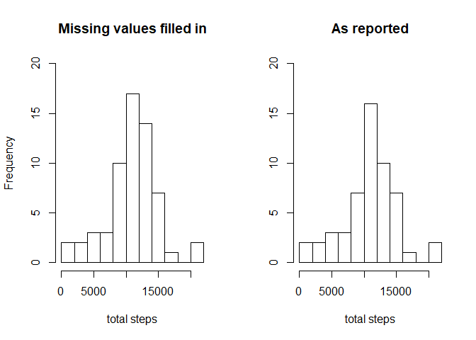

## Loading and preprocessing the data

```r
library(lubridate)
library(dplyr)
library(ggplot2)
```

```r
activity.raw <- read.csv("activity.csv")
str(activity.raw)
```

```
## 'data.frame':	17568 obs. of  3 variables:
##  $ steps   : int  NA NA NA NA NA NA NA NA NA NA ...
##  $ date    : Factor w/ 61 levels "2012-10-01","2012-10-02",..: 1 1 1 1 1 1 1 1 1 1 ...
##  $ interval: int  0 5 10 15 20 25 30 35 40 45 ...
```

```r
activity.raw %>% mutate(date=as.Date(date,"%Y-%m-%d")) -> activity
## sample
activity[c(1:3,17278:17280),]
```

```
##       steps       date interval
## 1        NA 2012-10-01        0
## 2        NA 2012-10-01        5
## 3        NA 2012-10-01       10
## 17278     0 2012-11-29     2345
## 17279     0 2012-11-29     2350
## 17280     0 2012-11-29     2355
```

```r
str(activity)
```

```
## 'data.frame':	17568 obs. of  3 variables:
##  $ steps   : int  NA NA NA NA NA NA NA NA NA NA ...
##  $ date    : Date, format: "2012-10-01" "2012-10-01" ...
##  $ interval: int  0 5 10 15 20 25 30 35 40 45 ...
```

```r
## distribution of dates/intervals with missing values for steps
as.data.frame(table(activity[is.na(activity$steps)==1,2])) 
```

```
##         Var1 Freq
## 1 2012-10-01  288
## 2 2012-10-08  288
## 3 2012-11-01  288
## 4 2012-11-04  288
## 5 2012-11-09  288
## 6 2012-11-10  288
## 7 2012-11-14  288
## 8 2012-11-30  288
```
The activity data contains 61 (17568/288) complete days, with 288=24*12 (24 hours, each contains twelve 5-minute intervals) measurements per day. The interval IDs are obviously in yymm format - read.csv reads them as integers and it's OK.   

The missing measurements are present for 8 dates and all step values for these eight days - two Mondays, one Wednesday, one Thursday, two Fridays, one saturday, and one Sunday (no Tuesdays)  - are missing. The  weekdays might be important, as many people have weekly routines.


## What is mean total number of steps taken per day?

```r
activity %>% group_by(date) %>%summarise(totsteps=sum(steps)) -> daily
mm<-paste0("Mean is ", 
           format( mean(daily$totsteps,na.rm=T),nsmall=1)," and median is ",
           format( median(daily$totsteps,na.rm=T)))
hist(daily$totsteps, main="Total steps per day: distribution",xlab=mm,
     breaks=15)
```

<!-- -->


## What is the average daily activity pattern?

```r
activity %>% filter(is.na(steps)==0) %>% group_by(interval) %>% 
    summarise(avgstep=mean(steps)) ->activity_by_int
with(activity_by_int, plot(interval,avgstep,type="l"))
```

<!-- -->

```r
## interval with max avgstep
maxstep<-activity_by_int[activity_by_int$avgstep==max(activity_by_int$avgstep),1]
```
Max average number of steps corresponds to 835.


## Imputing missing values
As mentioned earlier, people often have weekly routines. Accordingly, for the days with missing step counts, I am using the averages for the same weekday-interval combination.

```r
activity %>%
    mutate(wkday=wday(date,label=T)) %>% 
    group_by(interval,wkday) %>% 
    summarise(avgstep=mean(steps,na.rm=T)) ->activity_by_int_wkday

tmp<-merge(mutate(activity,wkday=wday(date,label=T)),activity_by_int_wkday)
# activityF - with filled-in missing values, and weekdays 
tmp %>% mutate(steps=ifelse(is.na(steps)==T,avgstep,steps)) %>%
    select(-avgstep) -> activityF

activityF %>% group_by(date) %>%summarise(totsteps=sum(steps)) -> dailyF
par(mfrow=c(1,2))

hist(dailyF$totsteps,main="Missing values filled in",xlab="total steps",
     ylim=c(0,20),breaks = 15)
hist(daily$totsteps,main="As reported",xlab="total steps",
     ylab="",ylim=c(0,20),breaks=15)
```

<!-- -->

```r
daily  %>% summarise(meanS=mean(totsteps,na.rm = T),
                            medS=median(totsteps,na.rm = T)) ->DD
dailyF %>% summarise(meanS=mean(totsteps),
                            medS=median(totsteps)) -> DDF
```
The histograms are similar, but not identical, and agrregate values are affected by imputting.  Before imputting, mean=10766.19 and 
median=10765. After imputting, mean=10821.21 and median=11015.  
After imputting, the aggregate values have increased, but not by much. 


## Are there differences in activity patterns between weekdays and weekends?
For this part of the assignment, I was required to use the dataset with the filled-in missing values and to create a new factor variable  with two levels – “weekday” and “weekend.”

```r
activityF %>% mutate(isWkEnd=ifelse(wkday %in% c('Sat','Sun'),
                                    "weekend","weekday")) -> activityF2
activityF2 %>%
    group_by(interval,isWkEnd) %>% 
    summarise(avgstep=mean(steps)) ->activityF2_by_int_isWkEnd
# ggplot(activityF2_by_int_isWkEnd,aes(interval,avgstep)) ->g3
# g3+geom_line()+facet_grid(rows=vars(isWkEnd))
G1 <- ggplot(activityF2_by_int_isWkEnd, aes(interval,avgstep)) 
G1<- G1 + geom_line() + facet_grid(rows=vars(isWkEnd)) 
G1<- G1 + labs(y="average number of steps in an interval",
               title="weekdays vs. weekends")
G1 + theme(plot.title = element_text(hjust = 0.5))
```

<!-- -->
  
The chart shows that, on average, the daily activity on weekends start and ends later than on weekdays.


